## Sonda-import
    Título do Projeto: ANÁLISE E APRIMORAMENTO DAS ESTIMATIVAS DE RADIAÇÃO SOLAR POR SATÉLITE GL
    A PARTIR DE IMAGENS GOES-16

    Palavras-Chaves: INPE, Radiação Solar, Satélites Meteorológicos, Modelagem, Cachoeira Paulista

Este é Projeto de Iniciação Científica - CNPq, com uso de dados da rede [SONDA](http://sonda.ccst.inpe.br/) e [SolRad-NET](https://solrad-net.gsfc.nasa.gov/) para validação do Modelo GL.

## Uteis
* [VARIAVEIS](http://sonda.ccst.inpe.br/infos/variaveis.html)
* [BASE DE DADOS](http://sonda.ccst.inpe.br/basedados/index.html)
* [PLANILHA SONDA](https://docs.google.com/spreadsheets/d/1ES7P4ceGymjs6OZsKRsFb3sd5BV8xkTk7Xd2MNBP59U/edit?usp=sharing)
* [PLANILHA Solrad-net](https://docs.google.com/spreadsheets/d/1X-PWb7m5uWbimovofMT0PRdH1fbAE42fSPsN49ktA4Y/edit?usp=sharing)
* [Matplotlib: Python plotting](https://matplotlib.org/)
* [MODELO GL versão 1.2](http://satelite.cptec.inpe.br/radiacao/docs/RefTT/RTecnico001-2011-RST-20110624b.pdf)
* [AVALIANDO RADIAÇÃO SOLAR POR SATÉLITE](./BIBLIO/Avaliando_RSolar_por_Sat%C3%A9lite_Ceballos_et_al.pdf)

## Docs
* [RESUMO](./RELATORIO/Resumo/Resumo_versão_final.docx)
* [RELATORIO PARCIAL](./RELATORIO/Parcial/Relatorioparcial-2019-02.pdf)
* [RELATORIO FINAL](./RELATORIO/Final/RelatorioFinal-07-19.pdf)
* [POSTER ](./RELATORIO/Poster-PIBIC-Luiz-08Ago%5Bcor%5D.pdf)

## Imagens
### Ciclo diurno e resolução espacial
| Céu Claro             | Céu Nublado |
:-------------------------:|:-------------------------:
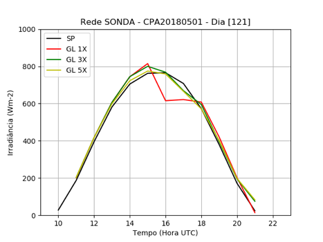 | 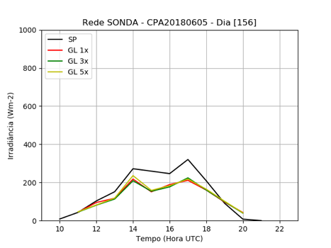
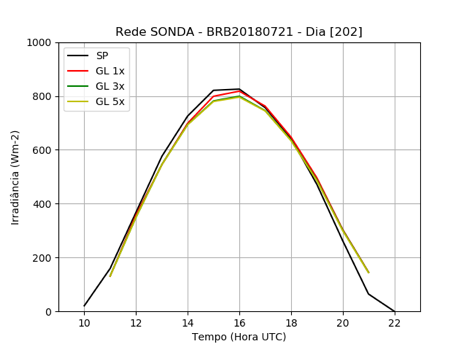 | 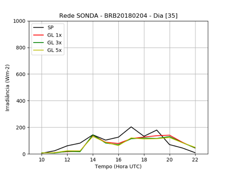
 | 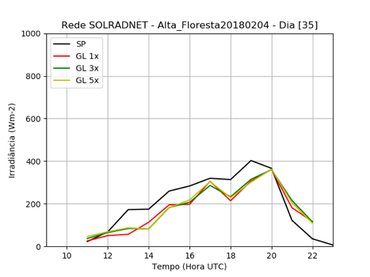
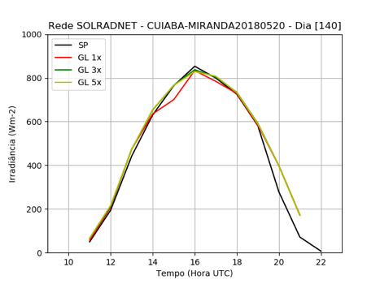 | 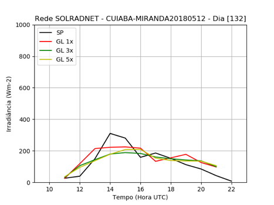
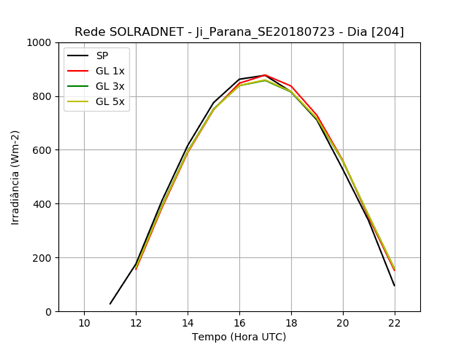 | 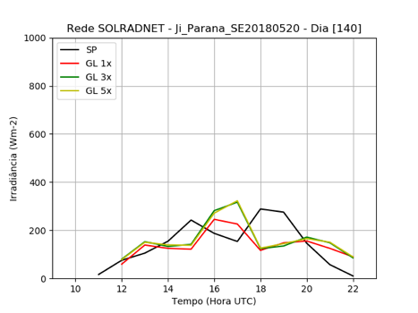
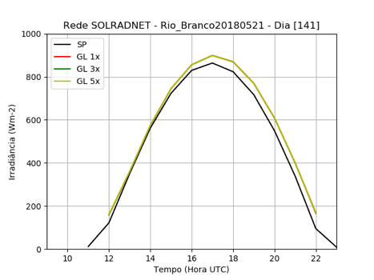 | 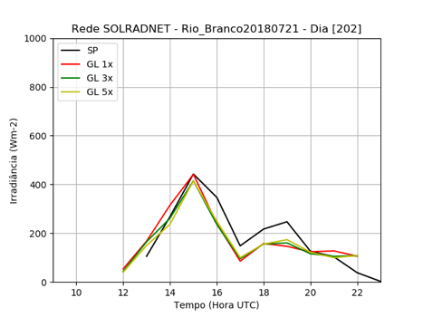

Exemplos de ciclos diurnos de radiação solar global medida e estimada pelo GL1.2 em diferentes resoluções espaciais (1x1, 3x3 e 5x5 pixels) e níveis de nebulosidade. SP= medidas de superfície

### Ciclo diurno médio de céu claro
|                          |                          |
:-------------------------:|:-------------------------:
(A) 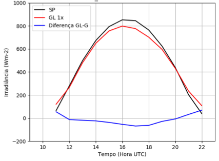 | (B) 
(C) 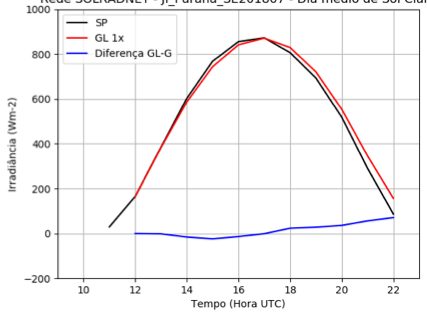 |
(D) 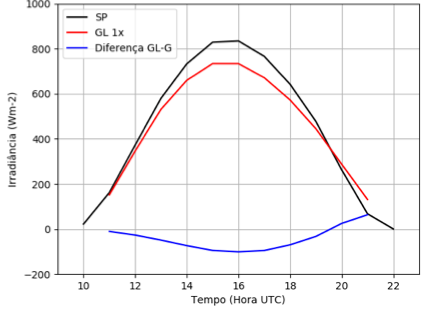 | (E) 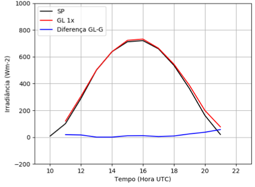

Ciclos diurnos médios medidos e estimados via GL1.2 para dias de céu claro mês de julho 2018. (a) Alta Floresta, (b) Cuiabá-Miranda, (c) Ji-Paraná, (d) Brasília e (e) Cachoeira Paulista. 

### Concordância entre valores diários (medida vs GL1.2)
|                          |                          |
:-------------------------:|:-------------------------:
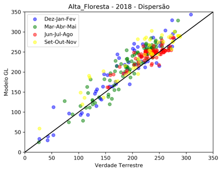 | 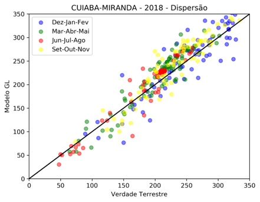
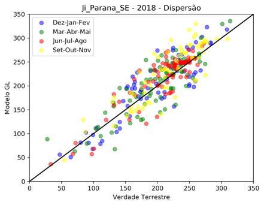 | 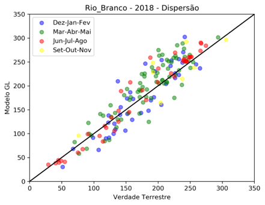
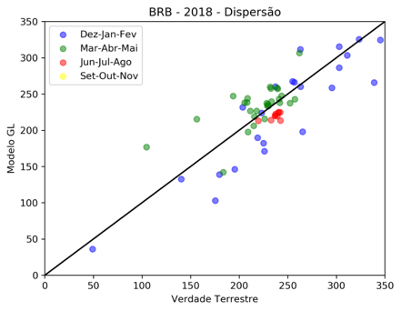 | 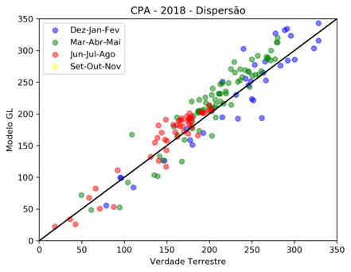

Dispersão entre valores diários de irradiância solar global medida e estimada por satélite para o ano de 2018. 

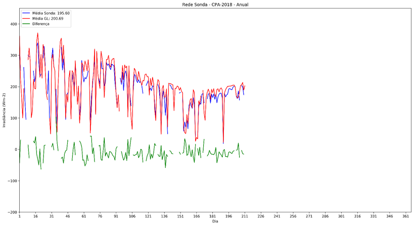
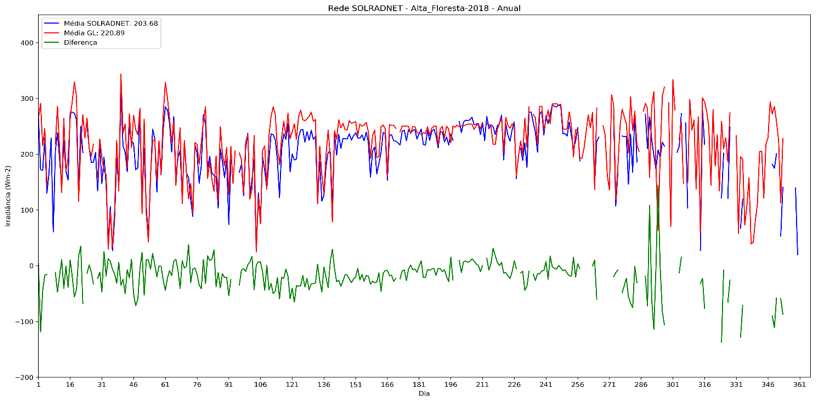

Variabilidade diária da irradiância solar medida (linha azul), estimada GL1.2 (linha vermelha) e diferença (G-GL1.2, linha verde) ao decorrer do ano de 2018 para duas estações: Cachoeira Paulista e Alta Floresta. 

