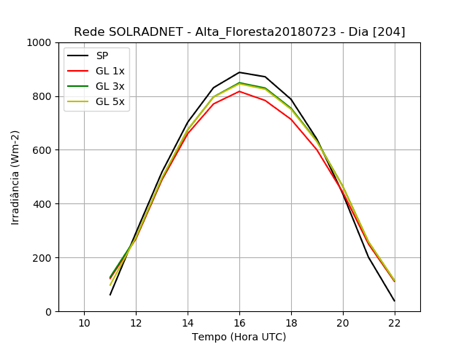

## Sonda-import
    Título do Projeto: ANÁLISE E APRIMORAMENTO DAS ESTIMATIVAS DE RADIAÇÃO SOLAR POR SATÉLITE GL
    A PARTIR DE IMAGENS GOES-16

    Palavras-Chaves: INPE, Radiação Solar, Satélites Meteorológicos, Modelagem, Cachoeira Paulista

Este é Projeto de Iniciação Científica - CNPq, com uso de dados da rede [SONDA](http://sonda.ccst.inpe.br/) e [SolRad-NET](https://solrad-net.gsfc.nasa.gov/) para validação do Modelo GL.

## Uteis
* [VARIAVEIS](http://sonda.ccst.inpe.br/infos/variaveis.html)
* [BASE DE DADOS](http://sonda.ccst.inpe.br/basedados/index.html)
* [PLANILHA SONDA](https://docs.google.com/spreadsheets/d/1ES7P4ceGymjs6OZsKRsFb3sd5BV8xkTk7Xd2MNBP59U/edit?usp=sharing)
* [PLANILHA Solrad-net](https://docs.google.com/spreadsheets/d/1X-PWb7m5uWbimovofMT0PRdH1fbAE42fSPsN49ktA4Y/edit?usp=sharing)
* [Matplotlib: Python plotting](https://matplotlib.org/)

## Docs
* [MODELO GL versão 1.2](http://satelite.cptec.inpe.br/radiacao/docs/RefTT/RTecnico001-2011-RST-20110624b.pdf)
* [AVALIANDO RADIAÇÃO SOLAR POR SATÉLITE](https://github.com/LuizFelipeNeves/Sonda-import/blob/master/src/docs/Avaliando_RSolar_por_Sat%C3%A9lite_Ceballos_et_al.pdf)

## Imagens

| Céu Claro             | Céu Nublado |
:-------------------------:|:-------------------------:
 | 
 | 
 | 

Exemplos de ciclos diurnos de radiação solar global medida e estimada pelo GL1.2 em diferentes resoluções espaciais (1x1, 3x3 e 5x5 pixels) e níveis de nebulosidade. SP= medidas de superfície
